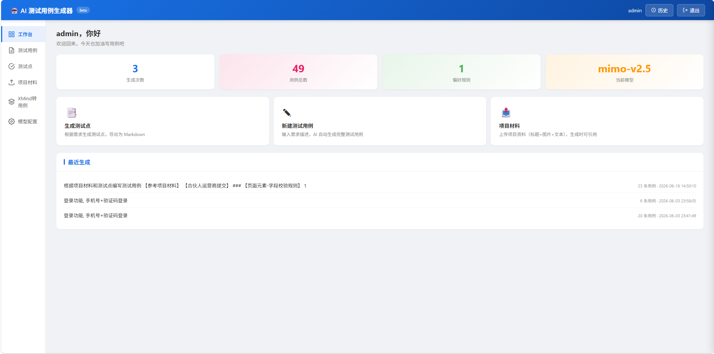
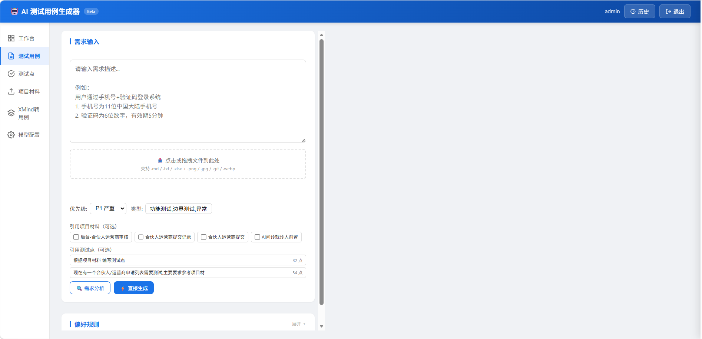
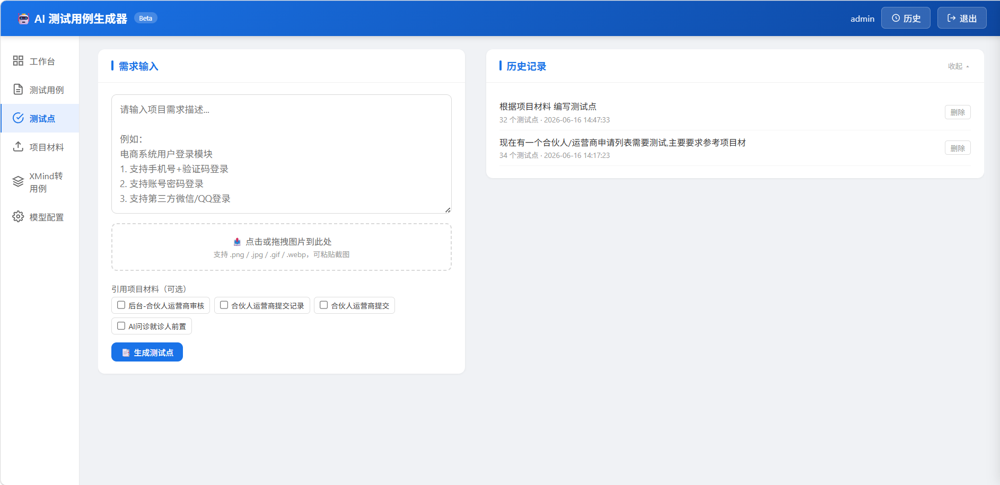

# AI 测试用例生成器 🧪

基于大模型（LLM）的测试用例自动生成工具。输入需求描述或 UI 截图，AI 自动生成测试点和测试用例，支持 Excel / Markdown 导出。

---

## ✨ 功能一览

| 能力 | 说明 |
|------|------|
| **多模态输入** | Markdown / TXT / Excel / UI 截图 / 设计稿，文字图片混合使用 |
| **智能分段生成** | 自动拆解需求为模块，最多 5 路并行生成 |
| **测试点生成** | 按模块 → 子分类 → 测试点三级结构，树形展示 |
| **完整用例生成** | 前置条件、步骤、预期结果、优先级、类型，覆盖 7 个测试维度 |
| **AI 评审 & 优化** | 6 维质量评审 + 自动优化，展示变更 diff |
| **XMind 转用例** | 上传思维导图，AI 解析结构生成测试用例 |
| **偏好学习** | 用户编辑用例后，AI 提取偏好规则，越用越贴合 |
| **去重机制** | 精确去重（标题+预期）→ 步骤语义去重（Jaccard 相似度） |
| **安全特性** | API Key 加密存储、CSRF 保护、越权防护、路径安全 |
| **双 SDK 支持** | 兼容 OpenAI / Anthropic 格式，支持 DeepSeek、千问、Kimi、MiMo 等 |

---

## 🖼 界面预览

| 工作台 | 测试用例生成 | 测试点管理 |
|:------:|:------------:|:----------:|
|  |  |  |

---

## 🚀 快速开始

```bash
# 1. 安装依赖
pip install -e ".[dev]"

# 2. 配置 API（编辑 config.yaml，或启动后在 Web 界面配置）
cp config.yaml.example config.yaml

# 3. 启动
python start.py                  # 浏览器自动打开 http://localhost:5000
python start.py -p 8080 --debug  # 指定端口 + 调试模式
```

### Docker 部署

```bash
cp .env.example .env
docker-compose up -d
# 访问 http://localhost:5000
```

---

## 📁 项目结构

```
testcase-gen/
├── start.py              # Web 启动入口
├── main.py               # 命令行入口
├── CLAUDE.md             # Claude Code 项目指令
├── .claude/              # Claude Code 技能 + 子代理配置
├── core/                 # 核心业务
│   ├── generator.py      # 用例生成 + Prompt 模板
│   ├── db.py             # SQLite 数据库
│   ├── llm_client.py     # LLM 调用封装
│   ├── reviewer.py       # 评审 + 优化
│   └── output.py         # Excel/MD 导出 + 去重
├── web/                  # Web 路由
│   ├── data.py           # 测试点 + 项目材料 API
│   ├── generate.py       # 用例生成/评审/优化 API
│   └── auth.py           # 认证
├── static/               # 前端（原生 HTML/JS）
├── tests/                # pytest 测试（126 个）
├── config.yaml           # 配置（不追踪 git）
└── pyproject.toml        # 项目配置
```

---

## 🤖 Claude Code 集成

内置斜杠命令和子代理，对话中直接使用：

| 斜杠命令 | 功能 |
|----------|------|
| `/unit-test` | 运行测试，支持按文件/关键词过滤 |
| `/code-quality` | 审查代码注释覆盖率与一致性 |
| `/git-commit` | 安全提交 → GitHub + Gitee 双推送 |
| `/edit-prompt` | 查找并编辑 AI 提示词 |
| `/review-test-cases` | 评审用例质量 |
| `/generate-test-points` | 生成测试点 |

| 子代理 | 职责 |
|--------|------|
| `test-agent` | 运行测试、诊断失败、补充覆盖 |
| `code-quality-agent` | 核查注释一致性、代码规范、潜在缺陷 |
| `prompt-engineer` | 优化所有 AI 提示词 |

---

## 🧪 测试与代码规范

```bash
pytest                              # 全部测试（126 passed）
pytest tests/test_generator.py -v   # 指定模块
pytest --cov=. --cov-report=term     # 覆盖率报告
ruff check .                        # lint 检查
ruff format .                       # 格式检查
```

---

## 📄 License

MIT
