# AI 测试工程平台 🧪

基于大模型（LLM）的 AI 测试工程平台（AI Test Engineering Platform）。输入需求描述或 UI 截图，AI 自动生成测试点和测试用例，支持 Excel / Markdown 导出。

当前有两条并存的产品线：**V1**（`/`，Prompt→用例的自由文本链路，见下表）与 **V2**（`/v2`，按 13 步蓝图重构的**结构化测试工程链路**：Requirement IR → 策略引擎 → 用例合成 → 追溯 → 6 维评审 → 去重优化 → 人工编辑闭环 → Runtime 一键串联 → Benchmark 质量评价）。V2 不是「Prompt→LLM→结果」，而是「结构化数据 → 规则/策略 → LLM → 结构化数据 → Validator → Reviewer → 结构化数据」：确定性关注点代码化，LLM 只做语义理解与内容生成，产物一律先过代码校验再入库。进度与决策见 `docs/v2/PROGRESS.md`。

---

## ✨ 功能一览

| 能力 | 说明 |
|------|------|
| **多模态输入** | Markdown / TXT / Excel / UI 截图 / 设计稿，文字图片混合使用 |
| **智能分段生成** | 自动拆解需求为模块，最多 5 路并行生成 |
| **测试点生成** | 按模块 → 子分类 → 测试点三级结构，树形展示 |
| **完整用例生成** | 前置条件、步骤、预期结果、优先级、类型，覆盖 7 个测试维度 |
| **AI 评审 & 优化** | 6 维质量评审 + 自动优化，展示变更 diff |
| **XMind 转用例** | 上传思维导图，AI 解析结构生成测试用例 |
| **偏好学习** | 用户编辑用例后，AI 提取偏好规则，越用越贴合 |
| **去重机制** | 精确去重（标题+预期）→ 步骤语义去重（Jaccard 相似度） |
| **安全特性** | API Key 加密存储、CSRF 保护、越权防护、路径安全 |
| **双 SDK 支持** | 兼容 OpenAI / Anthropic 格式，支持 DeepSeek、千问、Kimi、MiMo 等 |
| **V2 结构化链路** | Requirement IR（Pydantic 严格校验）→ 测试点 → 策略引擎（代码算边界/等价类/权限矩阵）→ 用例合成 → 追溯链与变更影响 → 6 维评审 → 语义去重归档 → 人工编辑（Revision 快照 + 乐观锁） |
| **V2 Runtime** | 一次调用串起 Step 2→8（`run_v2_pipeline`），Web / CLI 同一条路径 |
| **V2 质量基准** | bench-v0.1（10 case + 83 条人工独立 Gold）+ 四态 Matching + 三轨关联 + 硬/软双轨评价 + 五态可靠性 + 环境指纹 runset |
| **正式 baseline-v0.1** | 10/10 case 全量真实跑通并封存（模型 `deepseek-v4.1-flash` / 阿里云百炼），机器可读基线入库 |
| **S8 Compare / Delta** | 任一新 runset 与 baseline 做逐格 delta（improvement / regression / unchanged），跨模型/跨数据集自动判不可比，无 CI 门禁 |

---

## 🖼 界面预览（V2 · React SPA）

真实渲染截图，1440×900，无头浏览器 E2E 走查产物（播种账号 `ui_reviewer`，数据为合成验收数据「订单退款申请（UI 验收数据）」）。
系统设置页的 API Key 只显示「已配置」徽标，不出现任何凭据。

| 工作台 | 测试运行列表 | 运行概览 |
|:------:|:----------:|:-------:|
| 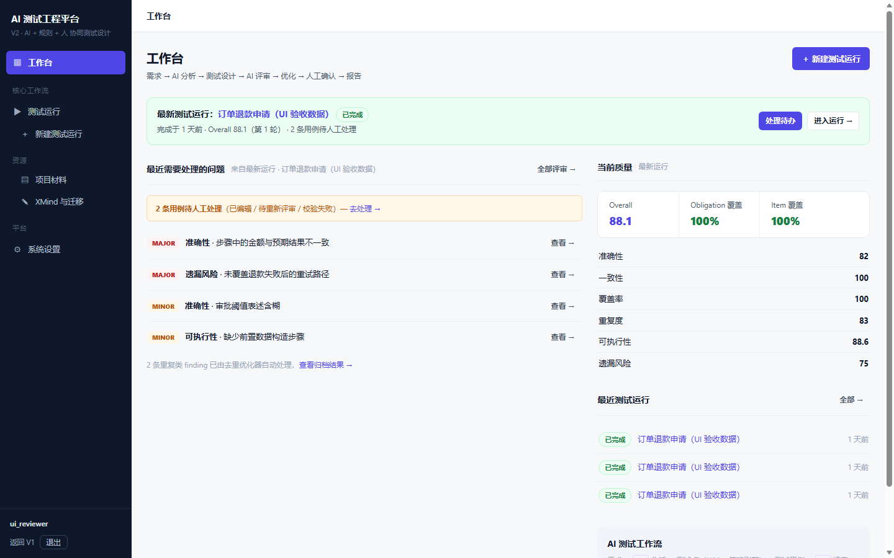 | 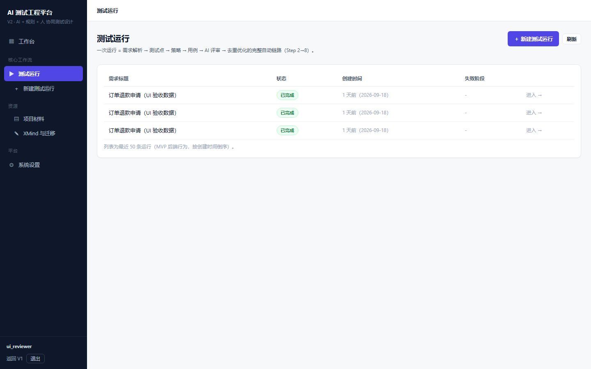 | 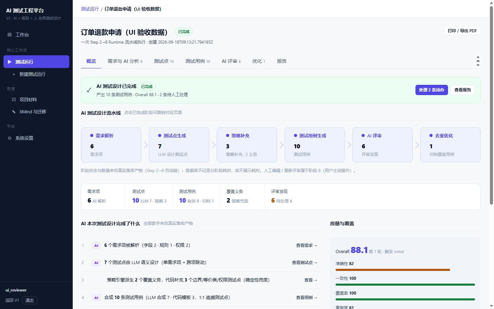 |

| 需求与 AI 分析（IR） | 测试点 | 测试用例 |
|:------------------:|:-----:|:-------:|
| 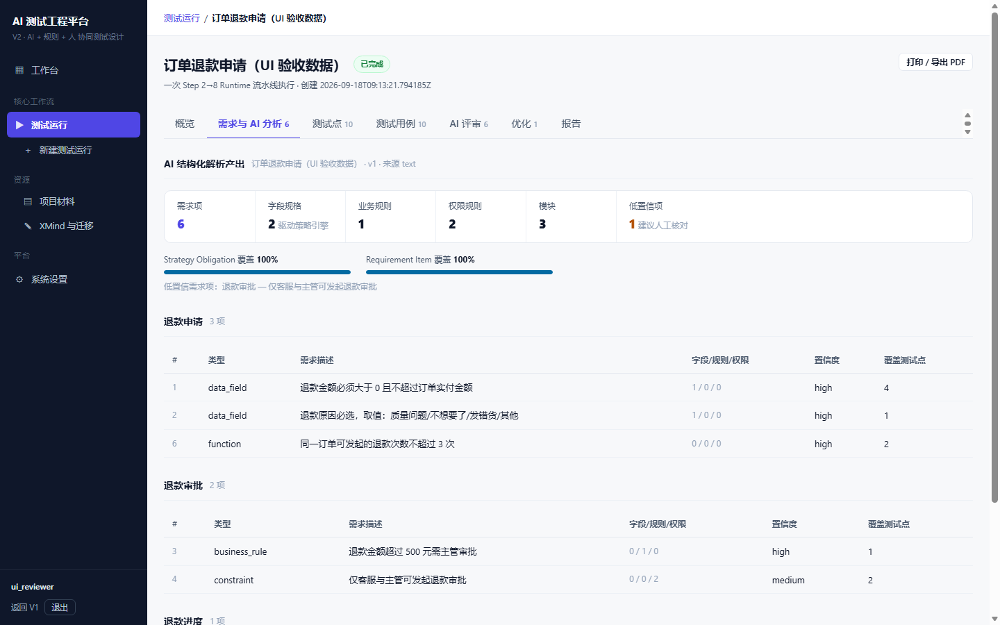 | 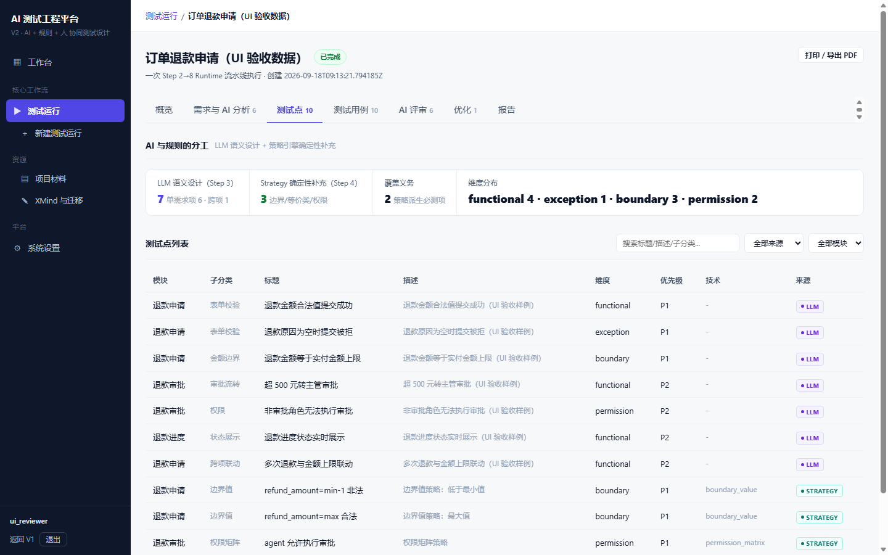 | 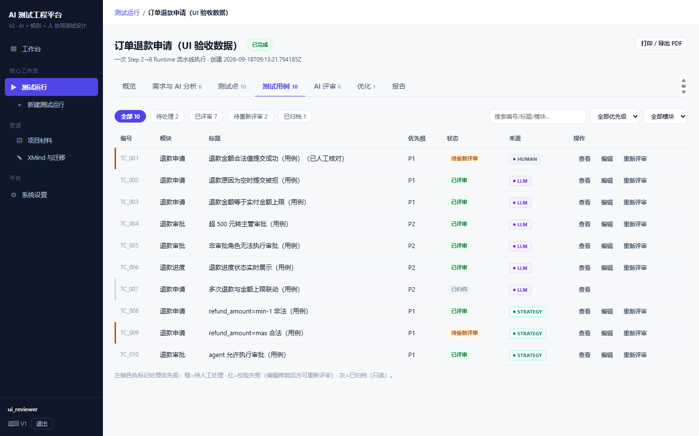 |

| AI 评审（6 维） | 去重优化 | 报告 |
|:-------------:|:-------:|:----:|
| 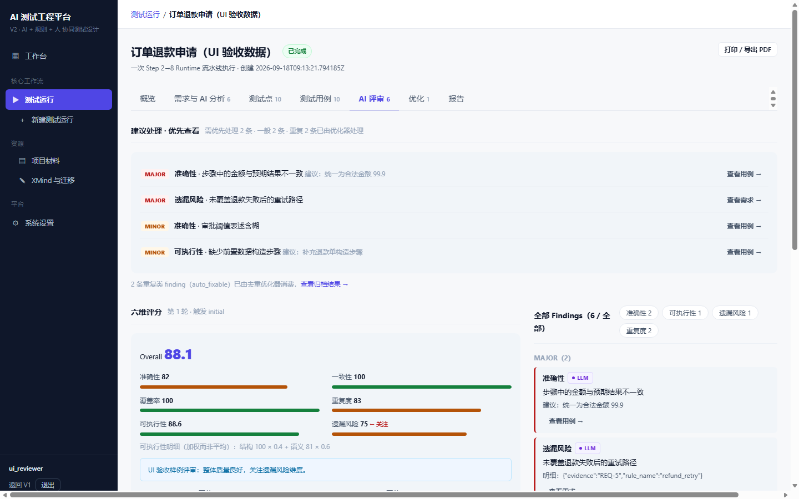 | 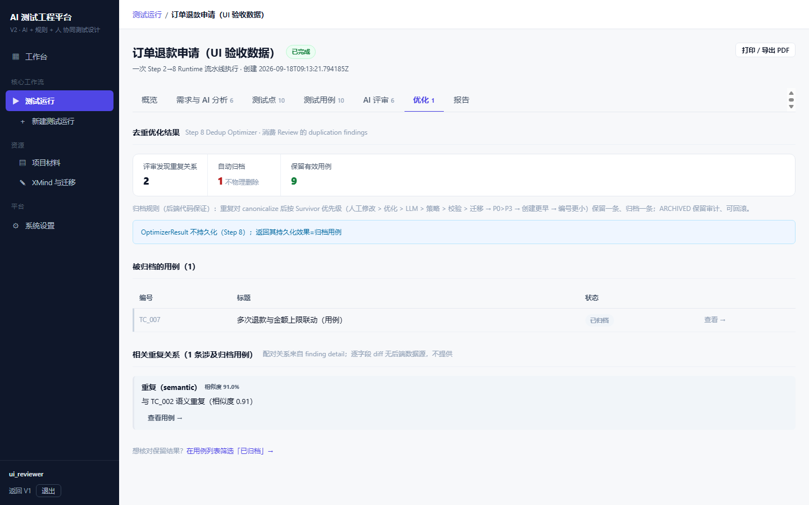 | 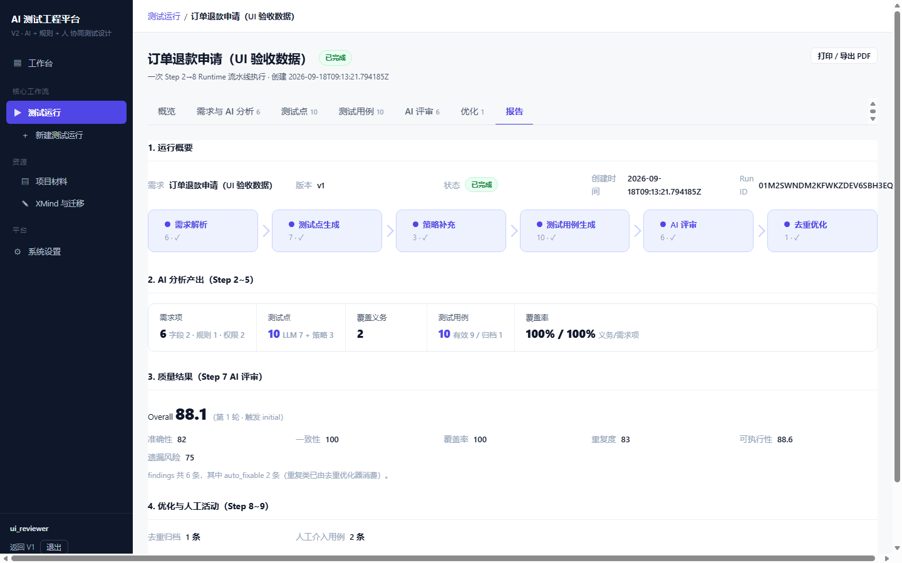 |

| 项目材料 | 系统设置 |
|:-------:|:-------:|
| 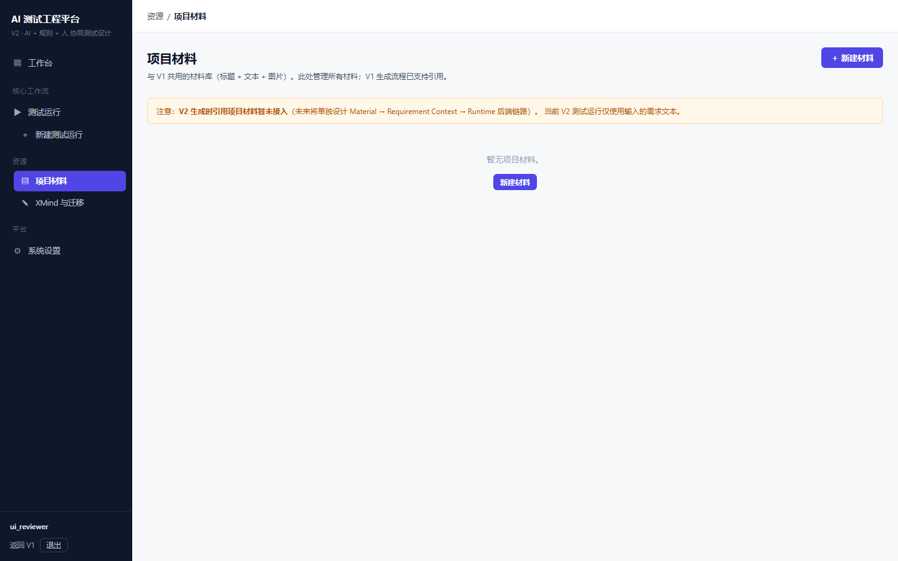 | 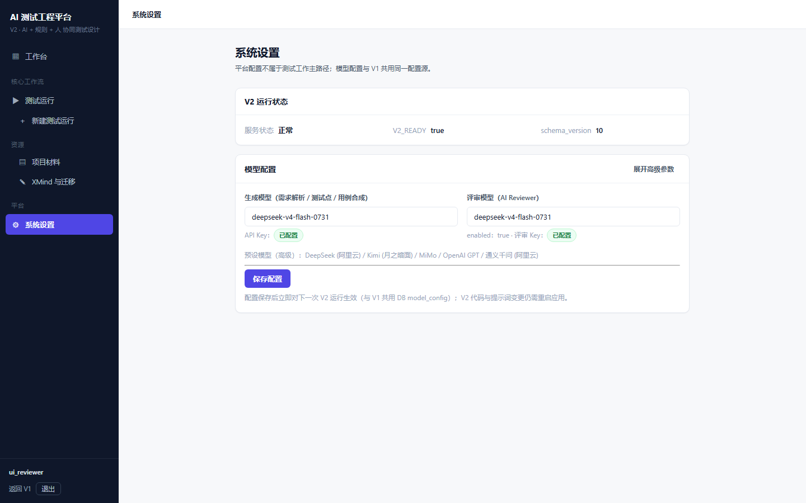 |

> V1 界面（`/`）的历史截图仍保留在 `screenshots/dashboard.png`、`testcase.png`、`testpoints.png`。
> 走查清单与结论见 `docs/v2/v2-ui-react-refactor.md`。

---

## 🚀 快速开始

```bash
# 1. 安装依赖
pip install -e ".[dev]"

# 2. 配置 API（编辑 config.yaml，或启动后在 Web 界面配置）
cp config.yaml.example config.yaml

# 3. 启动
python start.py                  # 浏览器自动打开 http://localhost:5000
python start.py -p 8080 --debug  # 指定端口 + 调试模式

# V2 页面：http://localhost:5000/v2 （复用 V1 登录态；改代码/提示词需重启，
#          但 Web 内「模型配置」保存后实时生效——它优先于 config.yaml）
```

### 质量基准（Benchmark）

```bash
# 全量跑 bench-v0.1（独立进程 + 独立 benchmark DB；会调用真实 LLM，一轮 10 case ≈ 1250 次调用）
python scripts/v2_benchmark.py                       # 产出 benchmark/runsets/<runset_id>/
python scripts/v2_benchmark.py --dry-run             # 只看执行计划（零 LLM / 零写盘）
python scripts/v2_benchmark.py --case bc_01_login    # 排障子集

# 与正式基线比较（S8：只读、零 LLM、零 DB、无门禁——质量退化不会返回非 0）
python scripts/v2_benchmark_compare.py \
  --baseline benchmark/baselines/baseline-v0.1.json \
  --candidate benchmark/runsets/<runset_id>
```

### Docker 部署

```bash
cp .env.example .env
docker-compose up -d
# 访问 http://localhost:5000
```

---

## 📁 项目结构

```
testcase-gen/
├── start.py              # Web 启动入口（V1 在 /，V2 在 /v2）
├── main.py               # 命令行入口
├── AGENTS.md / CLAUDE.md # 项目速查与协作约定（两文件同内容）
├── .claude/ .agents/ .codex/  # 助手侧配置：技能（斜杠命令）与子代理
├── core/                 # 核心业务
│   ├── generator.py      # [V1] 用例生成 + Prompt 模板
│   ├── db.py             # [V1] SQLite 数据库（V2 持久层独立，不改此文件）
│   ├── llm_client.py     # LLM 调用封装（含调用数/重试/失败对账）
│   ├── reviewer.py       # [V1] 评审 + 优化
│   ├── output.py         # Excel/MD 导出 + 去重
│   ├── schemas/          # [V2] Pydantic 唯一真源（需求/测试点/用例/策略/评审/Run）
│   ├── v2/               # [V2] 持久层 + 领域服务
│   │   ├── repository.py ddl.py db.py resolver.py fingerprint.py
│   │   ├── parser.py ir.py tp_*.py tc_*.py test_data_planner.py
│   │   ├── strategy/     # 边界值 / 等价类 / 权限矩阵（纯代码派生）
│   │   ├── traceability.py change_impact.py     # 追溯链 + 变更影响
│   │   ├── review_*.py optimizer*.py human_editor*.py  # 评审 / 去重 / 人工编辑
│   │   ├── runtime.py client_factory.py bootstrap.py   # 顶层 Runtime + 初始化
│   │   └── eval/         # [V2 质量评价] schema/matching/metrics_hard/metrics_soft
│   │                     #   rails（三轨关联）/ runner_lib（runset 指纹与落盘）
│   │                     #   compare（S8 只读 Compare/Delta）
├── web/                  # Web 路由
│   ├── data.py generate.py auth.py      # [V1] API
│   └── v2_service.py v2_routes.py       # [V2] 14 个 /api/v2/* 端点（复用 V1 鉴权）
├── static/               # [V1] 原生前端；static/v2/ 为 V2 构建产物
├── frontend-v2/          # [V2] React + TS + Vite 源码（Run-centric IA）
├── templates/v2.html     # [V2] SPA 壳
├── scripts/              # CLI：v2_real_run.py（真实全链路）· v2_step10_verify.py（一键验收）
│                         #       v2_benchmark.py（S6 Runner）· v2_benchmark_compare.py（S8 比较）
├── benchmark/            # 质量基准：cases/ + gold/ + manifests/（bench-v0.1）
│   ├── baselines/        # 机器可读正式基线 baseline-v0.1.json（入库）
│   ├── runsets/          # Runner 快照（gitignore，本地验收产物）
│   └── compares/         # S8 比较报告（gitignore，派生产物）
├── docs/v2/              # V2 蓝图/进度（PROGRESS.md 为单一真相源）+ 各 Step 设计
├── tests/                # pytest 测试（1378 passed + 3 skipped）
├── data/data.db          # [V1] 数据库
├── data/data_v2.db       # [V2] 独立数据库（schema_version=10）
├── config.yaml           # 配置（不追踪 git）
└── pyproject.toml        # 项目配置
```

---

## 🤖 Claude Code 集成

内置斜杠命令和子代理，对话中直接使用：

| 斜杠命令 | 功能 |
|----------|------|
| `/unit-test` | 运行测试，支持按文件/关键词过滤 |
| `/code-quality` | 审查代码注释覆盖率与一致性 |
| `/git-commit` | 安全提交 → GitHub + Gitee 双推送 |
| `/edit-prompt` | 查找并编辑 AI 提示词 |
| `/review-test-cases` | 评审用例质量 |
| `/generate-test-points` | 生成测试点 |

| 子代理 | 职责 |
|--------|------|
| `test-agent` | 运行测试、诊断失败、补充覆盖 |
| `code-quality-agent` | 核查注释一致性、代码规范、潜在缺陷 |
| `prompt-engineer` | 优化所有 AI 提示词 |

---

## 🧪 测试与代码规范

```bash
pytest                              # 全部测试（1378 passed + 3 skipped；含 V1 原有 126 例零回归）
pytest tests/test_generator.py -v   # 指定模块
pytest tests/test_benchmark_compare.py -v   # V2 Step 11 S8 比较层（全离线，零 LLM）
pytest --cov=. --cov-report=term     # 覆盖率报告
ruff check .                        # lint 检查
ruff format .                       # 格式检查

# V2 一键验收（22 条门槛报告表；--with-real-llm 需本地已有真实运行产物）
python scripts/v2_step10_verify.py
```

> `3 skipped` = 标记为 `real_llm` 的真实模型用例，默认跳过（避免烧额度）；设 `V2_RUN_REAL_LLM=1` 后启用。

---

## 📄 License

MIT
